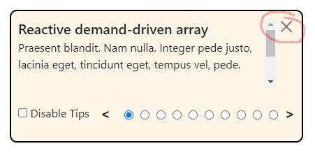
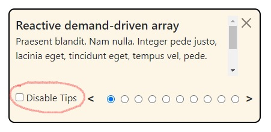
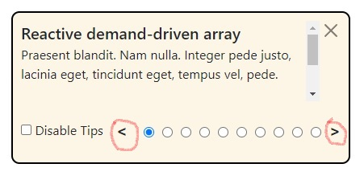
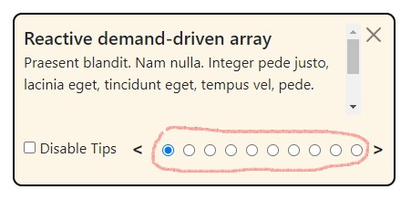

# Notifications

# Demo

# По клику на кнопку(отмечен красным кругом), либо нажатии клавиши Escape закрывает нотификацию

# Чекбокс(отмечен красным кругом) дизейблит нотификацию. Значение сохраняется в localstorage. При загрузке страницы, проверяется этот флаг, и если он в значениии "нотификации отключены", компонент не будет загружаться.

# По клику на стрелки(отмечены красными кругами), либо нажатием на клавиши ArrowLeft, ArrowRight переключаем нотификации из списка

# По клику на кнопки(отмечены красным кругом) переключаются натификации
